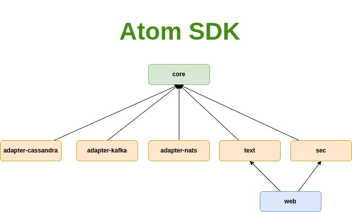

# atom

[](https://github.com/memoria-io/atom/actions?query=workflow%3ARelease)
[](https://github.com/orgs/memoria-io/packages?repo_name=atom)

[](https://sonarcloud.io/summary/new_code?id=memoria-io_atom)
[](https://sonarcloud.io/summary/new_code?id=memoria-io_atom)
[](https://sonarcloud.io/summary/new_code?id=memoria-io_atom)
[](https://sonarcloud.io/summary/new_code?id=memoria-io_atom)
[](https://sonarcloud.io/summary/new_code?id=memoria-io_atom)
[](https://sonarcloud.io/summary/new_code?id=memoria-io_atom)
[](https://sonarcloud.io/summary/new_code?id=memoria-io_atom)
[](https://sonarcloud.io/summary/new_code?id=memoria-io_atom)
[](https://sonarcloud.io/summary/new_code?id=memoria-io_atom)
[](https://sonarcloud.io/summary/new_code?id=memoria-io_atom)
[](https://sonarcloud.io/summary/new_code?id=memoria-io_atom)


> هذا العلم والعمل وقف للّه تعالي اسأل اللّه ان يرزقنا الاخلاص فالقول والعمل
>
> This work and knowledge is for the sake of Allah, may Allah grant us sincerity in what we say or do.

## Introduction

* Atom is a collection of utilities for web, and event based applications.
* Current JDK used is `Java 20`.
* Atom relies heavily
  on [Reactive Streams](https://www.reactive-streams.org/) and uses [Project-Reactor](https://projectreactor.io/),
  [Reactor Netty](https://github.com/reactor/reactor-netty), it also uses functional paradigms and collections
  from [Vavr](https://www.vavr.io/).

**Disclaimer:**
> `atom` is on edge, it's a work in progress and a pragmatic learning effort, so feel free to create issues or PRs.

## Usage

First make sure you can fetch repositories under such memoria organisation from github

```xml

<repositories>
    <repository>
        <id>github</id>
        <name>GitHub Packages</name>
        <url>https://maven.pkg.github.com/memoria-io/*</url>
        <releases>
            <enabled>true</enabled>
        </releases>
        <snapshots>
            <enabled>true</enabled>
        </snapshots>
    </repository>
</repositories>

```

Then import nomrally in your pom dependencies

```xml

<dependency>
    <groupId>io.memoria</groupId>
    <artifactId>atom</artifactId>
    <version>20.1.0</version>
</dependency>
```

## Versioning

The versioning is similar to semantic but with a shift where the first segment being the jdk version.

Format Example: `JDK_Version.major.mino`

## Atom Features

* Eventsourcing sdk
* Kafka, Nats adapters
* Virtual threading
* Vavr + Reactor Functional utilities
* Reactor Netty utility functions
* Reactive functional in-memory generic cruds (for tests, not for production)
* Jackson Adapter (Json & Yaml) utilities
* FileOps reader utility
* ResourceFileOps utility
* ConfigFileOps is a module for reading yaml configuration files (depends on Jackson Adapter)
    * Allows nesting of files using a marker e.g `include: sub_file.yaml` would replace this line with content
      of `sub_file.yaml`
    * Reading as a system property if not found as environment variable or else the default value if it was supplied:
        * `path: ${JAVA_HOME}`
        * `myVar: ${SOME_VAR:-defaultValue}`

# Architecture



## Core module

Core module has basic set of utilities:

* ConfigFileOps, and ResourceFileOps (similar to Typesafe HOCOON library)
* TextTransformer base interfaces

## Eventsourcing module

* Basic Eventsourcing functional interface
* Reactive pipeline
* Usage examples can be found in tests

## Adapter-* modules

Adapter initially were built to implement eventsourcing infra ports, but might later have more

## TODOs

* [x] Event Sourcing
    * [x] State decider, evolver, Stream commandAggregate
    * [x] Sagas decider, Stream commandAggregate
    * [x] id safety with typed classed (StateId, CommandId, EventId)
    * [x] Reducer
        * If using reduction the event reducer should map all states to creation event
        * Reducer can use the Evolver.reduce() to get to final state in which it would derive a creation event for the
          new compacted topic
* [x] Streaming
    * [x] Stream api for usage in event sourcing
* [x] Increase test coverage to >85%
* [ ] Use cases module to be used for integration tests
* [ ] Performance and benchmarks module
* [ ] JVM Profiling
* [ ] More structured releases based on PRs

## Release notes

* ~~`20.1.0` Fixing Jacoco and sonar to work with `--enable-preview`~~ was not published
* `20.2.0`
    * Nats pull based reactive approach instead of server push
    * Introducing etcd adapter as a KV repo
    * New mechanism for getting latest committed eventId
    * Test coverage increase (especially for the banking Use case)
    * Removal of CommandId, StateId, EventId value objects
        * Despite the benefits of value objects they were hard to maintain and had to copy almost all logic in Id
        * Having to implement Jackson SimpleModule for them meant I needed to create a new project module which inherits
          from EventSourcing and text which was too much of a hassle for couple of value objects

## Contribution


You can just do pull requests, and I will check them asap.

## Related Articles

* [Error handling using Reactor and VAVR](https://marmoush.com/2019/11/12/Error-Handling.html)
* [Why I stopped using getters and setters](https://marmoush.com/2019/12/13/stopped-using-getters-and-setters.html)
