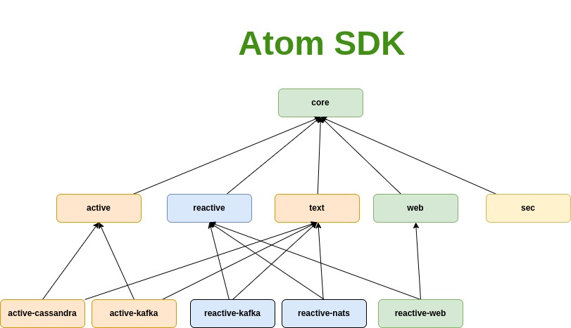

# atom

> هذا العلم والعمل وقف للّه تعالي اسأل اللّه ان يرزقنا الاخلاص فالقول والعمل
>
> This work and knowledge is for the sake of Allah, may Allah grant us sincerity in what we say or do.

## Introduction

* Atom is a collection of utilities for web, and event based applications.
* Current JDK used is `Java 19`.

**Disclaimer:**
> `atom` is on edge, it's a work in progress and a pragmatic learning effort, so feel free to create issues or PRs.

## Core module

Core module has basic set of utilities:

* Basic Eventsourcing functional interfaces
* ConfigFileOps, and ResourceFileOps (similar to Typesafe HOCOON library)
* TextTransformer base interfaces
* other

## Active module

Active module and submodules use the blocking virtual threading available starting jdk 19 preview.

## Reactive module

`reactive` relies heavily
on [Reactive Streams](https://www.reactive-streams.org/) and uses [Project-Reactor](https://projectreactor.io/),
[Reactor Netty](https://github.com/reactor/reactor-netty), it also uses functional paradigms and collections
from [Vavr](https://www.vavr.io/).

## Features

* Eventsourcing sdk in two flavours active, and reactive
* Kafka, Nats, Cassandra adapters
* Virtual threading
* Vavr + Reactor Functional utilities
* Reactor Netty utility functions
* Reactive functional in-memory generic cruds (for tests, not for production)
* Jackson Adapter (Json & Yaml) utilities
* FileOps reader utility
* ResourceFileOps utility
* ConfigFileOps is a module for reading yaml configuration files (depends on Jackson Adapter)
    * Allows nesting of files using a marker e.g `include: sub_file.yaml` would replace this line with content
      of `sub_file.yaml`
    * Reading as a system property if not found as environment variable or else the default value if it was supplied:
        * `path: ${JAVA_HOME}`
        * `myVar: ${SOME_VAR:-defaultValue}`

## TODOs

* [x] Event Sourcing
    * [x] State decider, evolver, Stream pipeline
    * [x] Sagas decider, Stream pipeline
    * [x] id safety with typed classed (StateId, CommandId, EventId)
    * [x] Events reduction
        * If using reduction the event reducer should map all states to creation event
        * Init states can't have creation events.
    * [x] Stream sharding to be used later for scaling
        * [x] Tests
        * Due to sharding (reading from **multiple** src event streams) the whole cluster should be down first before
          executing sharding, so that oldStreams are not receiving new events, while being ingested, they should be in
          read
          only state
* [x] Streaming
    * [x] Stream api for usage in event sourcing
* [ ] Increase test coverage to >85%

## Release notes

* Current versioning scheme `jbom_jdk_version.breaking_major.patch`

## Contribution

You can just do pull requests, and I will check them asap.

## Related Articles

* [Error handling using Reactor and VAVR](https://marmoush.com/2019/11/12/Error-Handling.html)
* [Why I stopped using getters and setters](https://marmoush.com/2019/12/13/stopped-using-getters-and-setters.html)
