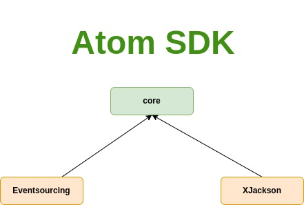

# atom

[](https://github.com/memoria-io/atom/actions?query=workflow%3ARelease)
[](https://github.com/orgs/memoria-io/packages?repo_name=atom)

[](https://sonarcloud.io/summary/new_code?id=memoria-io_atom)
[](https://sonarcloud.io/summary/new_code?id=memoria-io_atom)
[](https://sonarcloud.io/summary/new_code?id=memoria-io_atom)
[](https://sonarcloud.io/summary/new_code?id=memoria-io_atom)
[](https://sonarcloud.io/summary/new_code?id=memoria-io_atom)
[](https://sonarcloud.io/summary/new_code?id=memoria-io_atom)
[](https://sonarcloud.io/summary/new_code?id=memoria-io_atom)
[](https://sonarcloud.io/summary/new_code?id=memoria-io_atom)
[](https://sonarcloud.io/summary/new_code?id=memoria-io_atom)
[](https://sonarcloud.io/summary/new_code?id=memoria-io_atom)
[](https://sonarcloud.io/summary/new_code?id=memoria-io_atom)

> هذا العلم والعمل وقف للّه تعالي اسأل اللّه ان يرزقنا الاخلاص فالقول والعمل
>
> This work and knowledge is for the sake of Allah, may Allah grant us sincerity in what we say or do.

## Introduction

**Disclaimer:**
> `atom` is a work in progress utilities not meant for production usage yet, it's a pragmatic learning effort,
> please feel free to create issues or PRs.

Atom is an SDK to accelerate development, and it's a constant learning effort.

The currently used JDK is `24` and the motivation is to use the latest available JDK.

## Documentation

Can be found under the [.docs](/.docs) directory

## Modules



* The `core` module
    * The `core` module consists of and intended to only contain **POJO** utilities, and standard interfaces which are
      implemented by child modules
    * Some utilities like for configuration management like `ConfigFileOps`, and `ResourceFileOps` (similar to Typesafe
      HOCOON
      library)
* `sec` module
    * `sec` for security utilities, e.g encryption, hashing, json web tokens etc. You can check the pom for more details
      on the libraries it depends on.
* `text` module
    * The `text` module is utilities and standardization of text serialization/deserialization, it relies on jackson
      libraries.

## Usage

First make sure you can fetch repositories under such memoria organisation from github

```xml

<repositories>
    <repository>
        <id>github</id>
        <name>GitHub Packages</name>
        <url>https://maven.pkg.github.com/memoria-io/*</url>
        <releases>
            <enabled>true</enabled>
        </releases>
        <snapshots>
            <enabled>true</enabled>
        </snapshots>
    </repository>
</repositories>

```

Then import in your pom dependencies

```xml

<dependency>
    <groupId>io.memoria</groupId>
    <artifactId>atom</artifactId>
    <version>24.0.0</version>
</dependency>
```

## Versioning

The versioning is similar to semantic but with a shift where the first segment being the jdk version.

Format Example: `JDK_Version.major.mino`

## TODOs

* [x] Increase test coverage to >85%
* [ ] Event-sourcing refactoring
* [ ] Performance and benchmarks project "atom-performance"
* [ ] JVM Profiling
* [ ] More structured releasing once library is stable

## Release notes

* `24.3.0`
    * Removed web module
* `24.0.0`
    * JDK upgrade
    * Rebase on latest JBOM
* `22.0.0`
    * Sync Aggregates
    * Merging with Active/Reactive libs
    * Removing Unnecessary modules (etcd)
* `21.20.0`
    * Removed reliance on vavr
* `21.1.0`
    * Moving Event-sourcing and testsuite modules to reactive
* `20.11.0`
    * Moving reactive modules to separate repository [memoria-io/reactive](https://github.com/memoria-io/reactive)

## Contribution

You can just do pull requests, and I will check them asap.

## Related Articles

* [Error handling using Reactor and VAVR](https://marmoush.com/2019/11/12/Error-Handling.html)
* [Why I stopped using getters and setters](https://marmoush.com/2019/12/13/stopped-using-getters-and-setters.html)
